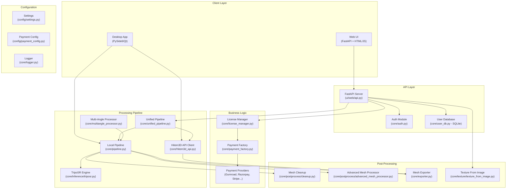

# ImageTo3D Pro — Complete Project Overview

> **Purpose**: This document is the master blueprint for the ImageTo3D Pro application. It contains everything an AI or developer needs to understand the full architecture, tech stack, and every file in the project, so the entire app can be rebuilt from scratch.

---

## 1. What Is ImageTo3D Pro?

**ImageTo3D Pro** is a production-grade SaaS + Desktop application that converts 2D images into 3D mesh models (OBJ, STL, GLB). It supports:

- **Local AI Processing** via TripoSR (CPU-based, offline)
- **Cloud API Processing** via Hitem3D API (GPU-powered, higher quality)
- **Multi-Angle Processing** (3–5 images for 10x quality boost)
- **Free Texture-from-Image** feature (lightweight, runs on Render free tier)
- **Monetization** via trial → license → subscription model
- **Dual Interfaces**: Web (FastAPI) and Desktop (PySide6/Qt)

**Revenue Model**: 1 free trial generation → Purchase license (Starter ₹499/mo, Pro ₹999/mo, Enterprise ₹4999/mo)

---

## 2. Architecture Diagram



---

## 3. Tech Stack

| Layer | Technology | Version | Purpose |
|-------|-----------|---------|---------|
| **Runtime** | Python | 3.11+ | Core language |
| **Web Framework** | FastAPI | latest | REST API + Web UI |
| **ASGI Server** | Uvicorn/Gunicorn | latest | HTTP server |
| **Desktop UI** | PySide6 | ≥6.5 | Qt-based desktop app |
| **AI Inference** | PyTorch | ≥2.0 | TripoSR model |
| **3D Processing** | Open3D | latest | Mesh manipulation |
| **3D Export** | Trimesh | latest | OBJ/STL/GLB export |
| **Image Processing** | Pillow, OpenCV | latest | Image preprocessing |
| **Background Removal** | rembg | latest | Remove image backgrounds |
| **HTTP Client** | httpx | latest | API calls to Hitem3D |
| **Auth** | bcrypt | ≥4.0 | Password hashing |
| **Database** | SQLite | built-in | User accounts & trials |
| **Deployment** | Render.com | free tier | Cloud hosting |
| **Payment** | Gumroad/Razorpay/Stripe | varies | Monetization |

---

## 4. Complete File Tree

```
ImageTo3D_Pro_Full_Working/
├── .gitignore                          # Git ignore rules
├── .python-version                     # Python version (3.11)
├── requirements.txt                    # All Python dependencies
├── render.yaml                         # Render.com deployment config
├── README.md                           # Project README
├── setup_admin.py                      # Admin user setup script
├── demo_workflow.py                    # Demo/test script
├── payload.json                        # Sample API payload
├── nvidia-kimi.curl                    # API test curl command
├── ImageTo3DPro.spec                   # PyInstaller build spec
│
├── config/                             # ═══ CONFIGURATION ═══
│   ├── __init__.py                     # Config package init (exports ConfigManager)
│   ├── settings.py                     # Centralized config (ProcessingConfig, APIConfig, UIConfig, SecurityConfig)
│   ├── payment_config.py              # Payment provider configs (Gumroad, Razorpay, Stripe, PayPal, UPI)
│   ├── auth.json                       # Bcrypt password hash storage (auto-generated)
│   ├── hitem3d_credentials.json       # Hitem3D API credentials
│   ├── license.json                    # License key storage (desktop)
│   ├── trial.json                      # Trial tracking data (desktop)
│   └── users.db                        # SQLite user database (web)
│
├── core/                               # ═══ BUSINESS LOGIC ═══
│   ├── __init__.py                     # Core package init
│   ├── unified_pipeline.py            # Main entry: routes to local or API pipeline
│   ├── pipeline.py                     # Local processing pipeline (TripoSR → cleanup → export)
│   ├── hitem3d_api.py                 # Hitem3D cloud API client
│   ├── multiangle_processor.py        # Multi-angle image processing (3-5 images)
│   ├── auth.py                         # Bcrypt auth + session tokens
│   ├── user_db.py                      # SQLite user database (web accounts, trials, licenses)
│   ├── license_manager.py             # License + trial management (desktop)
│   ├── payment_factory.py             # Payment processor factory pattern
│   ├── exporter.py                     # Open3D → Trimesh → OBJ/STL/GLB export
│   ├── logger.py                       # Structured JSON logging with rotation
│   │
│   ├── inference/                      # ═══ AI INFERENCE ═══
│   │   ├── model_manager.py           # Model factory (currently: TripoSR)
│   │   └── triposr.py                 # TripoSR wrapper (shells to run.py, CPU fallback)
│   │
│   ├── postprocess/                    # ═══ MESH POST-PROCESSING ═══
│   │   ├── cleanup.py                 # Basic mesh cleanup (dedup, smooth, normals)
│   │   └── advanced_mesh_processor.py # Advanced: repair, subdivision, remeshing
│   │
│   ├── providers/                      # ═══ PAYMENT PROVIDERS ═══
│   │   ├── __init__.py                 # Exports BasePaymentProvider
│   │   ├── base.py                     # Abstract base: Subscription, PaymentResult, License
│   │   ├── gumroad.py                 # Gumroad implementation (10% fee, no GST needed)
│   │   └── razorpay.py                # Razorpay implementation (2% fee, Indian market)
│   │
│   └── texture/                        # ═══ TEXTURE GENERATION ═══
│       ├── __init__.py                 # (NEW) Texture package init
│       └── texture_from_image.py      # (NEW) Free texture-from-image feature
│
├── ui/                                 # ═══ USER INTERFACES ═══
│   ├── web/
│   │   └── api.py                     # FastAPI app: 2000+ lines, full web UI + API endpoints
│   │
│   └── desktop/
│       ├── app.py                      # PySide6 desktop application (main window)
│       ├── app_v2.py                   # V2 placeholder
│       ├── license_dialog.py          # License/trial dialog UI
│       ├── multiangle_widget.py       # Multi-angle image selector widget
│       └── styles.qss                  # Qt stylesheet (dark theme)
│
├── tests/                              # ═══ TESTS ═══
│   ├── __init__.py                     # Test package init
│   ├── test_improvements.py           # Config, logging, bug fix tests
│   └── test_payment_system.py         # Payment system tests
│
├── input/                              # User input images (uploaded)
├── output/                             # Generated 3D models
├── logs/                               # Application logs (JSON, rotated)
├── models/                             # AI model cache
├── build/                              # PyInstaller build artifacts
├── dist/                               # Distribution executables
├── installer/                          # Installer scripts
├── docs/                               # Legacy docs folder
│   └── README.md                       # (old) Basic documentation
│
└── ImageTo3D_Pro/                      # ═══ THIS DOCUMENTATION ═══
    ├── 01_PROJECT_OVERVIEW.md          # (this file)
    ├── 02_SETUP_AND_INSTALLATION.md
    ├── 03_CONFIGURATION_GUIDE.md
    ├── 04_API_REFERENCE.md
    ├── 05_DEPLOYMENT_GUIDE.md
    ├── 06_USER_GUIDE.md
    ├── 07_DEVELOPER_GUIDE.md
    ├── 08_FREE_TEXTURE_FROM_IMAGE.md
    └── 09_MONETIZATION_STRATEGY.md
```

---

## 5. Data Flow

### 5.1 Image → 3D Model (Local Processing)

```
User uploads image
  → Unified Pipeline (core/unified_pipeline.py)
    → Local Pipeline (core/pipeline.py)
      → ModelManager → TripoSR.generate(image)
        → Shells out to TripoSR run.py
        → Returns Open3D TriangleMesh
      → clean_mesh() — deduplicate, smooth, normals
      → AdvancedMeshProcessor (if quality > "draft")
        → Hole repair, subdivision, remeshing
      → _apply_vertex_colors_from_image()
      → export_mesh() → OBJ, STL, GLB files
  → Return {obj, stl, glb, stats}
```

### 5.2 Image → 3D Model (Cloud API)

```
User uploads image + Hitem3D API token
  → Unified Pipeline
    → Hitem3DAPI.generate_3d_model(image, ...)
      → create_task() — POST to Hitem3D API
      → wait_for_completion() — poll every 5s
      → download_model() — download OBJ/GLB/ZIP
    → Return {obj, stl, glb, stats}
```

### 5.3 Authentication Flow (Web)

```
First visit → /setup → set admin password (bcrypt hash → config/auth.json)
Subsequent → /login → verify password → session cookie (HMAC-signed, 24h)
All API endpoints → Depends(require_session) → validate cookie
```

### 5.4 User Registration Flow (Web)

```
/register → create user in SQLite → initialize 1 free trial
/generate → check trial/license → if trial available, use it → generate
After trial used → /dashboard → enter license key → activate → full access
```

### 5.5 Monetization Flow

```
User exhausts free trial
  → Shown "Purchase License" dialog
  → Redirected to Gumroad/Razorpay checkout
  → Payment webhook → generate license key
  → User enters license key in app
  → License validated → credits added → full access
```

---

## 6. Key Design Decisions

| Decision | Rationale |
|----------|-----------|
| **CPU-only TripoSR** | Maximum compatibility — works on any machine without GPU drivers |
| **Fallback sphere mesh** | App never crashes — if TripoSR fails, returns a valid mesh |
| **Monolithic api.py** | Single-file web app with embedded HTML — simplifies Render deployment |
| **SQLite for user DB** | Zero-config, serverless, perfect for Render free tier |
| **Hardware fingerprinting** | Prevents license sharing across machines (desktop only) |
| **Payment factory pattern** | Switch providers by changing one config variable |
| **1 free trial generation** | Low barrier to entry, maximizes conversion |

---

## 7. Environment Variables

| Variable | Required | Description |
|----------|----------|-------------|
| `HITEM3D_ACCESS_TOKEN` | For cloud API | Hitem3D API access token |
| `HITEM3D_CLIENT_ID` | Alternative | Client ID for OAuth |
| `HITEM3D_CLIENT_SECRET` | Alternative | Client secret for OAuth |
| `IMAGETO3D_SECRET_KEY` | Optional | Session signing key (auto-generated if not set) |
| `GUMROAD_ACCESS_TOKEN` | For Gumroad | Gumroad API token |
| `RAZORPAY_KEY_ID` | For Razorpay | Razorpay key |
| `RAZORPAY_KEY_SECRET` | For Razorpay | Razorpay secret |
| `STRIPE_SECRET_KEY` | For Stripe | Stripe API key |
| `PORT` | Render | Port number (set by Render) |

---

## 8. Quality Presets

| Preset | Processing | Use Case |
|--------|-----------|----------|
| `draft` | Basic cleanup only (fast) | Quick preview |
| `standard` | Cleanup + basic mesh processing | General use |
| `high` | Advanced repair + smoothing | Professional output |
| `production` | Full repair + subdivision + remeshing | Animation-ready |

---

## 9. Pricing Tiers

| Plan | Price (INR/mo) | Credits | Features |
|------|---------------|---------|----------|
| **Free Trial** | ₹0 | 1 generation | Try before buy |
| **Starter** | ₹499 | 100/month | Multi-angle (3), Standard quality |
| **Pro** | ₹999 | 300/month | Multi-angle (5), High quality, API access |
| **Enterprise** | ₹4999 | 2000/month | Unlimited multi-angle, Production quality |

Credit packs also available: 100 credits (₹199), 500 credits (₹799), 2000 credits (₹2499)

---

## 10. Deployment Target

- **Platform**: Render.com (free tier)
- **Runtime**: Python + Gunicorn + Uvicorn workers
- **Build**: `pip install -r requirements.txt`
- **Start**: `gunicorn ui.web.api:app -k uvicorn.workers.UvicornWorker --bind 0.0.0.0:$PORT`
- **Config**: `render.yaml` at project root

---

## 11. Known Limitations

1. **Render free tier**: 512MB RAM — TripoSR local processing won't work (requires 6GB+). Use Hitem3D API or the free texture feature instead.
2. **SQLite**: Single-writer concurrency — fine for low-medium traffic, needs PostgreSQL for high scale.
3. **Session storage**: In-memory (lost on restart) — consider Redis for persistence.
4. **License validation**: Desktop uses offline cache with 7-day grace period.
5. **torch dependency**: ~2GB — makes Docker images large. Consider CPU-only torch for web deployments.

---

*Next: See [02_SETUP_AND_INSTALLATION.md](./02_SETUP_AND_INSTALLATION.md) for complete setup instructions.*
