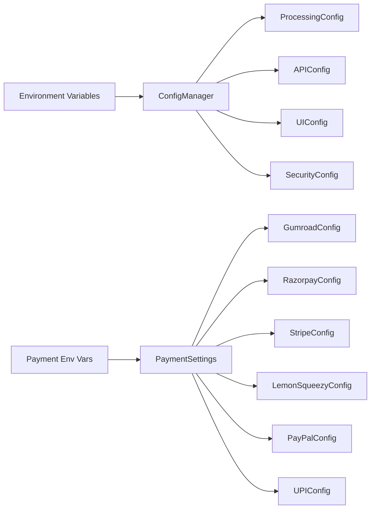

# ImageTo3D Pro — Configuration Guide

> **Purpose**: Every configuration file, every setting, every environment variable. This document contains the **complete source code** for all config modules so any AI can recreate them exactly.

---

## 1. Configuration Architecture



---

## 2. File: `config/__init__.py`

```python
"""
Configuration package for ImageTo3D Pro.

This package provides centralized configuration management.
"""

from config.settings import config, ConfigManager
from config.settings import ProcessingConfig, APIConfig, UIConfig, SecurityConfig

__all__ = [
    "config",
    "ConfigManager",
    "ProcessingConfig",
    "APIConfig",
    "UIConfig",
    "SecurityConfig",
]
```

---

## 3. File: `config/settings.py` — Complete Source

```python
"""
Centralized Configuration Module for ImageTo3D Pro

This module provides centralized configuration management with validation,
type safety, and environment variable support.
"""

import os
from dataclasses import dataclass, field
from typing import Optional, Dict, Any, List
from pathlib import Path
import json


@dataclass(frozen=True)
class ProcessingConfig:
    """Configuration for image processing pipeline."""
    min_images: int = 3
    max_images: int = 5
    target_resolution: tuple = (1024, 1024)
    confidence_threshold: float = 0.6
    fusion_method: str = "weighted_average"
    align_cameras: bool = True
    quality_boost_factor: float = 2.5
    local_min_ram_gb: float = 6.0
    default_quality: str = "standard"
    available_qualities: tuple = ("draft", "standard", "high", "production")


@dataclass(frozen=True)
class APIConfig:
    """Configuration for Hitem3D API integration."""
    base_url: str = "https://api.hitem3d.com/v1"
    timeout_seconds: int = 60
    max_retries: int = 3
    retry_delay_seconds: float = 1.0
    
    # Credit costs per model and resolution
    credit_costs: Dict[str, Dict[str, int]] = field(default_factory=lambda: {
        "hitem3dv1.5": {"512": 15, "1024": 20, "1536": 50, "1536pro": 70},
        "hitem3dv2.0": {"1536": 75, "1536pro": 90},
        "scene-portraitv1.5": {"1536": 70},
        "scene-portraitv2.0": {"1536pro": 70},
        "scene-portraitv2.1": {"1536pro": 70},
    })


@dataclass(frozen=True)
class UIConfig:
    """Configuration for UI behavior and appearance."""
    app_name: str = "Image → 3D Pro"
    app_version: str = "1.0.0"
    min_window_size: tuple = (720, 560)
    system_refresh_interval_ms: int = 3000
    balance_check_delay_ms: int = 600
    update_check_delay_ms: int = 800
    
    # Supported image formats
    supported_image_formats: tuple = (".png", ".jpg", ".jpeg", ".bmp", ".webp")
    
    # Output formats
    output_formats: tuple = ("obj", "stl", "glb", "fbx", "usdz")


@dataclass(frozen=True)
class SecurityConfig:
    """Configuration for security settings."""
    min_password_length: int = 8
    bcrypt_rounds: int = 12
    token_min_length: int = 10


class ConfigManager:
    """
    Centralized configuration manager with environment variable support.
    
    Usage:
        from config.settings import config
        
        # Access configuration
        min_ram = config.processing.local_min_ram_gb
        api_timeout = config.api.timeout_seconds
    """
    
    def __init__(self):
        self._processing = ProcessingConfig()
        self._api = APIConfig()
        self._ui = UIConfig()
        self._security = SecurityConfig()
        self._load_from_environment()
    
    def _load_from_environment(self):
        """Load configuration overrides from environment variables."""
        # API Configuration
        if os.getenv("HITEM3D_API_URL"):
            object.__setattr__(self._api, 'base_url', os.getenv("HITEM3D_API_URL"))
        
        if os.getenv("HITEM3D_TIMEOUT"):
            try:
                timeout = int(os.getenv("HITEM3D_TIMEOUT"))
                object.__setattr__(self._api, 'timeout_seconds', timeout)
            except ValueError:
                pass
        
        # UI Configuration
        if os.getenv("IMAGETO3D_UPDATE_URL"):
            object.__setattr__(self._ui, 'update_url', os.getenv("IMAGETO3D_UPDATE_URL"))
        
        # Processing Configuration
        if os.getenv("IMAGETO3D_MIN_RAM"):
            try:
                min_ram = float(os.getenv("IMAGETO3D_MIN_RAM"))
                object.__setattr__(self._processing, 'local_min_ram_gb', min_ram)
            except ValueError:
                pass
    
    @property
    def processing(self) -> ProcessingConfig:
        """Get processing configuration."""
        return self._processing
    
    @property
    def api(self) -> APIConfig:
        """Get API configuration."""
        return self._api
    
    @property
    def ui(self) -> UIConfig:
        """Get UI configuration."""
        return self._ui
    
    @property
    def security(self) -> SecurityConfig:
        """Get security configuration."""
        return self._security
    
    def get_required_credits(self, model: str, resolution: str) -> Optional[int]:
        """
        Get required credits for a specific model and resolution.
        
        Args:
            model: Model identifier (e.g., "hitem3dv1.5")
            resolution: Resolution identifier (e.g., "1024")
            
        Returns:
            Credit cost or None if not found
        """
        model_costs = self._api.credit_costs.get(model, {})
        return model_costs.get(resolution)
    
    def is_valid_quality(self, quality: str) -> bool:
        """Check if quality level is valid."""
        return quality in self._processing.available_qualities
    
    def is_supported_image_format(self, filepath: str) -> bool:
        """Check if file extension is a supported image format."""
        return any(filepath.lower().endswith(ext) for ext in self._ui.supported_image_formats)


# Global configuration instance
config = ConfigManager()


# Convenience exports
__all__ = [
    "config",
    "ConfigManager",
    "ProcessingConfig",
    "APIConfig",
    "UIConfig",
    "SecurityConfig",
]
```

---

## 4. File: `config/payment_config.py` — Complete Source

```python
"""
Payment Configuration for ImageTo3D Pro

Switch between payment providers by changing PAYMENT_PROVIDER variable.
No code changes needed elsewhere!
"""

from dataclasses import dataclass, field
from typing import Dict, Optional, List
from enum import Enum


class PaymentProvider(str, Enum):
    """Available payment providers."""
    GUMROAD = "gumroad"
    LEMONSQUEEZY = "lemonsqueezy"
    RAZORPAY = "razorpay"
    STRIPE = "stripe"
    PAYPAL = "paypal"
    CASHFREE = "cashfree"
    UPI = "upi"  # Manual UPI QR mode


# ═══════════════════════════════════════════════════════════════
# 🔧 SWITCH PAYMENT PROVIDER HERE
# ═══════════════════════════════════════════════════════════════
PAYMENT_PROVIDER = PaymentProvider.GUMROAD  # Change this to switch providers

# Options:
# - PaymentProvider.GUMROAD      # No registration, 10% fee, fastest setup
# - PaymentProvider.LEMONSQUEEZY # No registration, 5% fee
# - PaymentProvider.RAZORPAY     # Indian, 2% fee, requires GST
# - PaymentProvider.STRIPE       # Global, 2-3% fee, requires business
# - PaymentProvider.PAYPAL       # Global, 2.5% fee
# - PaymentProvider.CASHFREE     # Indian, 1.9% fee, requires GST
# - PaymentProvider.UPI          # Manual, 0% fee, no automation
# ═══════════════════════════════════════════════════════════════


@dataclass(frozen=True)
class PaymentSettings:
    """Payment configuration settings."""
    
    # Provider selection
    provider: PaymentProvider = PAYMENT_PROVIDER
    
    # Test mode (use sandbox/test credentials)
    test_mode: bool = True
    
    # Currency
    currency: str = "INR"  # USD for international
    
    # FREE TRIAL SETTINGS
    # Number of free generations allowed before requiring license
    trial_generations: int = 1  # 1 free generation
    
    # License key settings
    license_key_length: int = 32
    license_key_prefix: str = "I3D"
    
    # Webhook settings
    webhook_secret: Optional[str] = None
    webhook_url: Optional[str] = None


@dataclass(frozen=True)
class PricingConfig:
    """Pricing tiers for subscriptions and credits."""
    
    # Subscription plans - NO FREE PLAN (pay-only)
    plans: Dict[str, Dict] = field(default_factory=lambda: {
        "starter": {
            "name": "Starter",
            "price": 499,  # INR per month
            "credits_per_month": 100,
            "features": ["Multi-angle (3 images)", "Standard quality", "Email support"],
        },
        "pro": {
            "name": "Pro",
            "price": 999,  # INR per month
            "credits_per_month": 300,
            "features": ["Multi-angle (5 images)", "High quality", "Priority support", "API access"],
        },
        "enterprise": {
            "name": "Enterprise",
            "price": 4999,  # INR per month
            "credits_per_month": 2000,
            "features": ["Unlimited multi-angle", "Production quality", "Dedicated support", "Custom models"],
        },
    })
    
    # Pay-per-use credits
    credit_packs: Dict[str, Dict] = field(default_factory=lambda: {
        "small": {
            "name": "100 Credits",
            "credits": 100,
            "price": 199,
        },
        "medium": {
            "name": "500 Credits",
            "credits": 500,
            "price": 799,
        },
        "large": {
            "name": "2000 Credits",
            "credits": 2000,
            "price": 2499,
        },
    })
    
    # Cost per API operation (in credits)
    operation_costs: Dict[str, int] = field(default_factory=lambda: {
        "local_processing": 1,
        "hitem3d_api_512": 15,
        "hitem3d_api_1024": 20,
        "hitem3d_api_1536": 50,
        "hitem3d_api_1536pro": 70,
    })


@dataclass(frozen=True)
class GumroadConfig:
    """Gumroad-specific configuration."""
    app_name: str = "ImageTo3D Pro"
    app_url: str = "https://imageto3d.pro"
    
    # Get these from Gumroad Settings > Advanced > Application
    access_token: Optional[str] = None  # GUMROAD_ACCESS_TOKEN env var
    
    # Product IDs (create products in Gumroad dashboard)
    product_ids: Dict[str, str] = field(default_factory=lambda: {
        "starter_monthly": "",  # Fill after creating product
        "pro_monthly": "",
        "enterprise_monthly": "",
        "credits_small": "",
        "credits_medium": "",
        "credits_large": "",
    })


@dataclass(frozen=True)
class RazorpayConfig:
    """Razorpay-specific configuration."""
    # Get from Razorpay Dashboard > Settings > API Keys
    key_id: Optional[str] = None  # RAZORPAY_KEY_ID env var
    key_secret: Optional[str] = None  # RAZORPAY_KEY_SECRET env var
    
    # Webhook secret
    webhook_secret: Optional[str] = None
    
    # Plan IDs (create in Razorpay dashboard)
    plan_ids: Dict[str, str] = field(default_factory=lambda: {
        "starter": "plan_xxxxxxxxxxxxx",
        "pro": "plan_xxxxxxxxxxxxx",
        "enterprise": "plan_xxxxxxxxxxxxx",
    })


@dataclass(frozen=True)
class StripeConfig:
    """Stripe-specific configuration."""
    # Get from Stripe Dashboard > Developers > API Keys
    publishable_key: Optional[str] = None  # STRIPE_PUBLISHABLE_KEY env var
    secret_key: Optional[str] = None  # STRIPE_SECRET_KEY env var
    webhook_secret: Optional[str] = None  # STRIPE_WEBHOOK_SECRET env var
    
    # Price IDs (create in Stripe dashboard)
    price_ids: Dict[str, str] = field(default_factory=lambda: {
        "starter_monthly": "price_xxxxxxxxxxxxx",
        "pro_monthly": "price_xxxxxxxxxxxxx",
        "enterprise_monthly": "price_xxxxxxxxxxxxx",
    })


@dataclass(frozen=True)
class LemonSqueezyConfig:
    """LemonSqueezy-specific configuration."""
    # Get from LemonSqueezy Settings > API
    api_key: Optional[str] = None  # LEMONSQUEEZY_API_KEY env var
    store_id: Optional[str] = None  # LEMONSQUEEZY_STORE_ID env var
    
    # Product/Variant IDs
    product_ids: Dict[str, str] = field(default_factory=lambda: {
        "starter": "",
        "pro": "",
        "enterprise": "",
    })


@dataclass(frozen=True)
class PayPalConfig:
    """PayPal-specific configuration."""
    # Get from PayPal Developer Dashboard
    client_id: Optional[str] = None  # PAYPAL_CLIENT_ID env var
    client_secret: Optional[str] = None  # PAYPAL_CLIENT_SECRET env var
    
    # Sandbox or Live
    mode: str = "sandbox"  # Change to "live" for production


@dataclass(frozen=True)
class UPIConfig:
    """UPI Manual QR configuration."""
    # Your UPI ID (e.g., yourname@upi)
    upi_id: Optional[str] = None  # UPI_ID env var
    
    # QR Code image path (display in app)
    qr_code_path: Optional[str] = None
    
    # Manual verification settings
    verification_method: str = "manual"  # "manual" or "screenshot_upload"
    
    # Support contact for payment issues
    support_email: Optional[str] = None
    support_phone: Optional[str] = None


# Global instances
payment_settings = PaymentSettings()
pricing_config = PricingConfig()
gumroad_config = GumroadConfig()
razorpay_config = RazorpayConfig()
stripe_config = StripeConfig()
lemon_squeezy_config = LemonSqueezyConfig()
paypal_config = PayPalConfig()
upi_config = UPIConfig()


__all__ = [
    "PaymentProvider",
    "PAYMENT_PROVIDER",
    "PaymentSettings",
    "PricingConfig",
    "GumroadConfig",
    "RazorpayConfig",
    "StripeConfig",
    "LemonSqueezyConfig",
    "PayPalConfig",
    "UPIConfig",
    "payment_settings",
    "pricing_config",
    "gumroad_config",
    "razorpay_config",
    "stripe_config",
    "lemon_squeezy_config",
    "paypal_config",
    "upi_config",
]
```

---

## 5. Environment Variable Reference

### General Application

| Variable | Default | Description |
|----------|---------|-------------|
| `IMAGETO3D_SECRET_KEY` | Auto-generated | Session signing key |
| `IMAGETO3D_MIN_RAM` | `6.0` | Minimum RAM (GB) for local processing |
| `IMAGETO3D_UPDATE_URL` | None | Update check URL |
| `PORT` | `8000` | Server port (set by Render) |

### Hitem3D API

| Variable | Default | Description |
|----------|---------|-------------|
| `HITEM3D_ACCESS_TOKEN` | None | API access token |
| `HITEM3D_CLIENT_ID` | None | OAuth client ID |
| `HITEM3D_CLIENT_SECRET` | None | OAuth client secret |
| `HITEM3D_API_URL` | `https://api.hitem3d.com/v1` | API base URL |
| `HITEM3D_TIMEOUT` | `60` | Request timeout (seconds) |

### Payment Providers

| Variable | Provider | Description |
|----------|----------|-------------|
| `GUMROAD_ACCESS_TOKEN` | Gumroad | API access token |
| `RAZORPAY_KEY_ID` | Razorpay | API key ID |
| `RAZORPAY_KEY_SECRET` | Razorpay | API key secret |
| `STRIPE_PUBLISHABLE_KEY` | Stripe | Publishable key |
| `STRIPE_SECRET_KEY` | Stripe | Secret key |
| `STRIPE_WEBHOOK_SECRET` | Stripe | Webhook verification |
| `LEMONSQUEEZY_API_KEY` | LemonSqueezy | API key |
| `LEMONSQUEEZY_STORE_ID` | LemonSqueezy | Store ID |
| `PAYPAL_CLIENT_ID` | PayPal | Client ID |
| `PAYPAL_CLIENT_SECRET` | PayPal | Client secret |
| `UPI_ID` | UPI | UPI address |

---

## 6. How to Switch Payment Providers

**Step 1**: Edit `config/payment_config.py`, line 27:

```python
# Change this single line:
PAYMENT_PROVIDER = PaymentProvider.RAZORPAY   # Switch from Gumroad to Razorpay
```

**Step 2**: Set the corresponding environment variables for your chosen provider.

**Step 3**: Create products/plans in your provider's dashboard and fill in the IDs.

**No other code changes needed** — the factory pattern handles everything.

---

## 7. JSON Config Files

### `config/auth.json` (auto-generated)

```json
{
  "password_hash": "$2b$12$XXXXXXXXXXXXXXXXXXXXXXXXXXXXXXXXXXXXXXXXXXXXXXXXXXXXXXXX",
  "secret_key": "XXXXXXXXXXXXXXXXXXXXXXXXXXXXXXXXXXXXXXXX"
}
```

### `config/license.json` (after activation)

```json
{
  "key": "I3D-XXXX-XXXX-XXXX-XXXX",
  "user_id": "user123",
  "plan_id": "pro",
  "credits": 300,
  "created_at": "2025-01-15T10:30:00",
  "expires_at": "2025-02-14T10:30:00",
  "hardware_fingerprint": "abc123def456...",
  "is_active": true,
  "last_validated": "2025-01-15T10:30:00",
  "offline_grace_period_end": "2025-01-22T10:30:00"
}
```

### `config/trial.json` (auto-created on first run)

```json
{
  "generations_used": 0,
  "generations_remaining": 1,
  "first_used_at": null,
  "last_used_at": null,
  "hardware_fingerprint": "abc123def456..."
}
```

### `config/hitem3d_credentials.json`

```json
{
  "access_token": "YOUR_TOKEN_HERE",
  "client_id": null,
  "client_secret": null
}
```

---

## 8. Credit Cost Matrix

| Model | Resolution | Credits |
|-------|-----------|---------|
| `hitem3dv1.5` | 512 | 15 |
| `hitem3dv1.5` | 1024 | 20 |
| `hitem3dv1.5` | 1536 | 50 |
| `hitem3dv1.5` | 1536pro | 70 |
| `hitem3dv2.0` | 1536 | 75 |
| `hitem3dv2.0` | 1536pro | 90 |
| `scene-portraitv1.5` | 1536 | 70 |
| `scene-portraitv2.0` | 1536pro | 70 |
| `scene-portraitv2.1` | 1536pro | 70 |
| Local processing | any | 1 |

---

*Next: See [04_API_REFERENCE.md](./04_API_REFERENCE.md) for the complete API documentation.*
