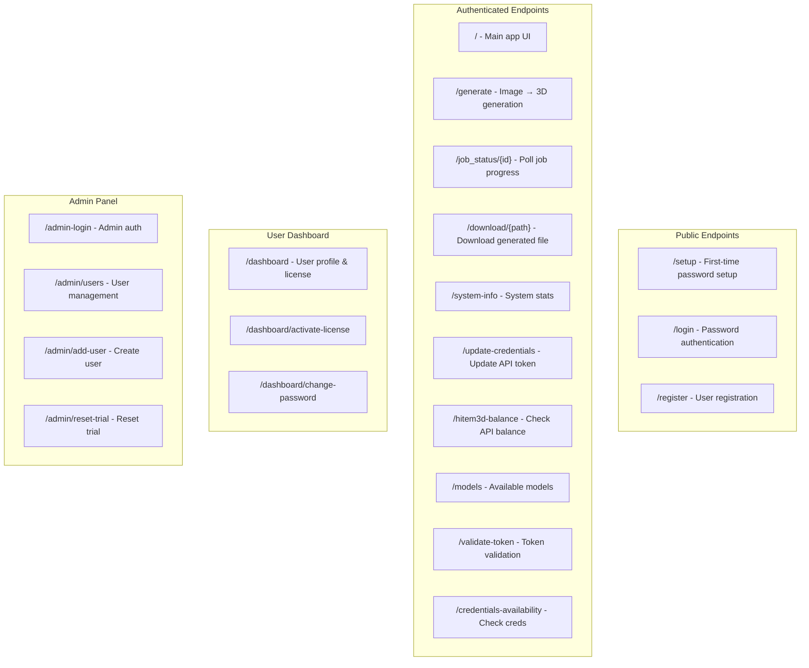

# ImageTo3D Pro — API Reference

> **Purpose**: Complete reference for every FastAPI endpoint, Python API call, request/response schemas, and authentication flow. An AI model can use this to recreate the entire web API.

---

## 1. API Architecture

The entire web API is a **single-file FastAPI application** at `ui/web/api.py` (~2017 lines). It serves both HTML pages (embedded in Python strings) and JSON API endpoints.



---

## 2. Authentication System

### 2.1 Session-Based Auth

The API uses bcrypt password hashing with HMAC-signed session cookies.

```
POST /setup → Set initial password (bcrypt hash → config/auth.json)
POST /login → Verify password → Set session cookie (24h validity)
All protected routes → Depends(require_session)
GET /logout → Clear session cookie
```

### 2.2 Auth Functions (from core/auth.py)

| Function | Description |
|----------|-------------|
| `is_password_configured()` | Check if bcrypt hash exists |
| `hash_password(plain)` | Hash with bcrypt |
| `verify_password(plain)` | Verify against stored hash |
| `set_password(plain)` | Store new hash in auth.json |
| `create_session_token()` | HMAC-signed token with expiry |
| `verify_session_token(token)` | Verify signature + check expiry |

### 2.3 Session Cookie

```python
COOKIE_NAME = "imagetoad_session"
MAX_AGE = 24 * 3600  # 24 hours
# Token format: base64(expiry_timestamp + HMAC-SHA256_signature)
```

---

## 3. Endpoint Reference

### 3.1 `GET /` — Main Application

**Auth**: Required (redirects to `/login` if not authenticated)  
**Response**: HTML page with embedded JavaScript UI  

The UI is a **~1100-line HTML string** embedded in `_main_app_html()` that includes:
- Image upload with drag-and-drop
- Processing options (quality, API/local toggle)
- Real-time progress polling via `/job_status/{id}`
- File download links
- System status panel
- Dark theme with modern styling

---

### 3.2 `POST /setup` — Initial Password Setup

**Auth**: None (only works if no password is configured)  
**Request**: Form data

| Field | Type | Required | Description |
|-------|------|----------|-------------|
| `password` | string | Yes | Must be ≥ 8 characters |
| `confirm` | string | Yes | Must match password |

**Response**: Redirect to `/login`

---

### 3.3 `POST /login` — Authenticate

**Auth**: None  
**Request**: Form data

| Field | Type | Required |
|-------|------|----------|
| `password` | string | Yes |

**Response**: 
- Success: Redirect to `/` with session cookie set
- Failure: HTML error page

---

### 3.4 `GET /logout` — End Session

**Auth**: Any  
**Response**: Redirect to `/login`, session cookie cleared

---

### 3.5 `POST /register` — Register New User

**Auth**: None  
**Request**: Form data

| Field | Type | Required |
|-------|------|----------|
| `username` | string | Yes |
| `email` | string | Yes |
| `password` | string | Yes |
| `confirm` | string | Yes |

**Response**: 
- Success: Redirect to `/login` with success message
- Failure: HTML error page (username taken, passwords don't match)

**Side Effects**: Creates user in SQLite, initializes 1 free trial generation

---

### 3.6 `GET /system-info` — System Information

**Auth**: Required  
**Response**: JSON

```json
{
  "cpu_count": 8,
  "cpu_percent": 23.5,
  "memory_total_gb": 16.0,
  "memory_available_gb": 10.2,
  "memory_percent": 36.2,
  "disk_total_gb": 500.0,
  "disk_free_gb": 234.5,
  "platform": "Windows-10-10.0.22631-SP0",
  "python_version": "3.11.9",
  "gpu_available": false,
  "gpu_name": null,
  "local_processing_possible": true
}
```

---

### 3.7 `POST /generate` — Generate 3D Model ⭐

**Auth**: Required  
**Request**: Multipart form data

| Field | Type | Default | Description |
|-------|------|---------|-------------|
| `file` | UploadFile | required | Image file (png/jpg/bmp/webp) |
| `use_api` | bool | `false` | Use Hitem3D cloud API |
| `api_token` | string | null | Hitem3D API token (optional) |
| `api_model` | string | `"hitem3dv1.5"` | API model ID |
| `api_resolution` | string | `"1024"` | Output resolution |
| `api_format` | string | `"glb"` | Output format |
| `quality` | string | `"standard"` | Quality preset |

**Response**: JSON

```json
{
  "job_id": "abc123def456",
  "status": "queued",
  "message": "Job started"
}
```

**Processing Flow**:
1. Validates session and trial/license
2. Saves uploaded file to `input/`
3. Creates async background job
4. Returns job_id for polling

---

### 3.8 `GET /job_status/{job_id}` — Poll Job Status

**Auth**: Required  
**Response**: JSON

```json
// During processing:
{
  "status": "processing",
  "progress": 45,
  "message": "Running TripoSR..."
}

// On completion:
{
  "status": "complete",
  "progress": 100,
  "files": {
    "obj": "output/model_abc123/model.obj",
    "stl": "output/model_abc123/model.stl",
    "glb": "output/model_abc123/model.glb"
  },
  "stats": {
    "vertices": 12450,
    "faces": 24880,
    "processing_time_seconds": 42.3,
    "fallback": false
  }
}

// On error:
{
  "status": "error",
  "message": "TripoSR failed: not enough memory"
}
```

**Job Storage**: In-memory `JOBS` dict, auto-pruned after 6 hours.

---

### 3.9 `GET /download/{path}` — Download File

**Auth**: Required  
**Path Param**: Filename within `output/` directory  
**Response**: File download (OBJ, STL, GLB, MTL, PNG)  
**Security**: Path traversal protection (filename only, no `..`)

---

### 3.10 `POST /update-credentials` — Update Hitem3D Token

**Auth**: Required  
**Request**: Form data

| Field | Type | Required |
|-------|------|----------|
| `token` | string | Yes |

**Response**: JSON

```json
{"status": "ok", "message": "Credentials updated"}
```

**Side Effect**: Writes to `config/hitem3d_credentials.json`

---

### 3.11 `POST /hitem3d-balance` — Check API Balance

**Auth**: Required  
**Request**: Form data

| Field | Type | Required |
|-------|------|----------|
| `api_token` | string | Optional (uses stored if not provided) |

**Response**: JSON

```json
{"balance": 450.0}
```

---

### 3.12 `GET /models` — Available Models

**Auth**: Required  
**Response**: JSON

```json
{
  "local": {
    "triposr": {
      "name": "TripoSR",
      "qualities": ["draft", "standard", "high", "production"],
      "formats": ["obj", "stl", "glb"]
    }
  },
  "api": {
    "hitem3dv1.5": {"resolutions": ["512", "1024", "1536", "1536pro"]},
    "hitem3dv2.0": {"resolutions": ["1536", "1536pro"]}
  }
}
```

---

### 3.13 User Dashboard Endpoints

#### `GET /dashboard` — User Profile

**Auth**: Required (user session)  
**Response**: HTML page showing:
- Username, registration date
- Trial status (generations used/remaining)
- License info (active plan, credits, expiry)
- License activation form
- Password change form

#### `POST /dashboard/activate-license` — Activate License Key

| Field | Type | Required |
|-------|------|----------|
| `license_key` | string | Yes |

#### `POST /dashboard/change-password` — Change Password

| Field | Type | Required |
|-------|------|----------|
| `new_password` | string | Yes |
| `confirm` | string | Yes |

---

### 3.14 Admin Panel Endpoints

#### `POST /admin-login` — Admin Authentication

| Field | Type | Required |
|-------|------|----------|
| `username` | string | Yes |
| `password` | string | Yes |

#### `GET /admin/users` — User Management Page

Shows all users with: username, registration date, trial status, credits, plan, admin controls

#### `POST /admin/add-user` — Create New User

| Field | Type | Required |
|-------|------|----------|
| `username` | string | Yes |
| `password` | string | Yes |

#### `POST /admin/reset-trial` — Reset User Trial

| Field | Type | Required |
|-------|------|----------|
| `user_id` | int | Yes |

---

## 4. Python API (Non-Web Usage)

### 4.1 Direct Pipeline Usage

```python
from core.unified_pipeline import run_pipeline

result = run_pipeline(
    image="path/to/image.png",
    name="my_model",
    output_dir="output",
    quality="standard",      # draft, standard, high, production
    scale=1.0,
    colorize_from_image=True,
)

# result = {"obj": "output/my_model.obj", "stl": "...", "glb": "...", "stats": {...}}
```

### 4.2 Hitem3D API Client

```python
from core.hitem3d_api import Hitem3DAPI

api = Hitem3DAPI(access_token="your_token")

# Check balance
balance = api.get_balance()

# Generate 3D model
result = api.create_task(
    image_path="input/photo.jpg",
    model="hitem3dv1.5",
    resolution="1024",
)

# Poll status
status = api.get_task_status(result["task_id"])

# Download
api.download_result(result["task_id"], output_path="output/model.glb")
```

### 4.3 License Manager

```python
from core.license_manager import get_license_manager

lm = get_license_manager()

# Check access
if lm.can_use_app():
    if lm.has_trial_available():
        lm.use_trial_generation()
    else:
        lm.deduct_credits(1)
    # Proceed with generation
else:
    # Show purchase dialog
    raise Exception("License required")
```

### 4.4 Payment Processor

```python
from core.payment_factory import PaymentProcessor

pp = PaymentProcessor()  # Uses configured provider

# List plans
plans = pp.list_available_plans()

# Generate license
key = pp.generate_license_key("user123", "pro")

# Validate license
license = await pp.validate_license(key)
```

---

## 5. Error Responses

All errors return JSON with consistent format:

```json
{
  "status": "error",
  "message": "Descriptive error message",
  "code": 401  // HTTP status code
}
```

| Code | When |
|------|------|
| 401 | Session expired or missing |
| 403 | Trial exhausted, license required |
| 404 | File not found, job not found |
| 422 | Invalid form data |
| 500 | Processing error |

---

## 6. CORS & Security

```python
# No CORS middleware added (same-origin only)
# Session cookies: HttpOnly, SameSite=Lax
# Path traversal: Filenames sanitized (no .. allowed)
# Passwords: bcrypt with 12 rounds
# Session tokens: HMAC-SHA256 with auto-generated secret
```

---

*Next: See [05_DEPLOYMENT_GUIDE.md](./05_DEPLOYMENT_GUIDE.md) for Render.com deployment instructions.*
