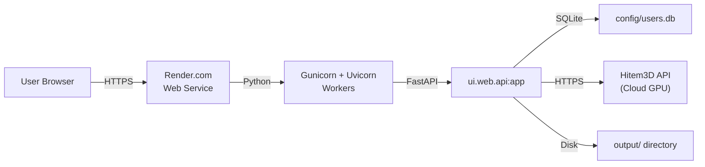

# ImageTo3D Pro — Deployment Guide (Render.com)

> **Purpose**: Complete guide to deploying ImageTo3D Pro on Render.com's free tier. Contains the exact `render.yaml`, environment variable setup, and production checklist.

---

## 1. Deployment Architecture



> **Important**: Render free tier has 512MB RAM. Local TripoSR processing (requires 6GB+) will **not** work. Use Hitem3D API or the free texture-from-image feature instead.

---

## 2. File: `render.yaml` — Complete Production Config

```yaml
services:
  - type: web
    name: imageto3d-pro
    runtime: python
    region: oregon           # or singapore for India
    plan: free               # free, starter, standard, pro
    
    # Build
    buildCommand: |
      pip install --upgrade pip
      pip install torch --index-url https://download.pytorch.org/whl/cpu
      pip install -r requirements.txt
    
    # Start  
    startCommand: gunicorn ui.web.api:app -k uvicorn.workers.UvicornWorker --bind 0.0.0.0:$PORT --workers 1 --timeout 120
    
    # Health check
    healthCheckPath: /
    
    # Environment variables
    envVars:
      - key: HITEM3D_ACCESS_TOKEN
        sync: false          # Set manually in dashboard
      - key: HITEM3D_CLIENT_ID
        sync: false
      - key: HITEM3D_CLIENT_SECRET
        sync: false
      - key: IMAGETO3D_SECRET_KEY
        generateValue: true  # Auto-generate random secret
      - key: GUMROAD_ACCESS_TOKEN
        sync: false
      - key: PYTHON_VERSION
        value: "3.11.9"
      - key: PORT
        value: "10000"
    
    # Persistent disk (optional, paid plans only)
    # disk:
    #   name: imageto3d-data
    #   mountPath: /data
    #   sizeGB: 1
```

---

## 3. Step-by-Step Deployment

### Step 1: Push to GitHub

```bash
cd ImageTo3D_Pro_Full_Working
git init
git add .
git commit -m "Initial commit - ImageTo3D Pro"
git remote add origin https://github.com/YOUR_USERNAME/imageto3d-pro.git
git push -u origin main
```

### Step 2: Create Render Service

1. Go to [render.com](https://render.com) → Sign up (free)
2. Click **"New +"** → **"Web Service"**
3. Connect your GitHub repository
4. Render auto-detects `render.yaml`

### Step 3: Configure Environment Variables

In Render Dashboard → Your Service → **Environment**:

| Variable | Value | Notes |
|----------|-------|-------|
| `HITEM3D_ACCESS_TOKEN` | Your token | Get from Hitem3D dashboard |
| `IMAGETO3D_SECRET_KEY` | (auto-generated) | Used for session signing |
| `GUMROAD_ACCESS_TOKEN` | Your token | Get from Gumroad settings |
| `PYTHON_VERSION` | `3.11.9` | Render Python version |

### Step 4: Deploy

Click **"Manual Deploy"** → **"Deploy latest commit"**

Build takes ~5-10 minutes (downloading PyTorch CPU, installing dependencies).

### Step 5: First-Time Setup

1. Visit your Render URL: `https://imageto3d-pro.onrender.com`
2. You'll be redirected to `/setup`
3. Set your admin password (stored as bcrypt hash)
4. Login with your password

---

## 4. Production Checklist

### Security
- [ ] Set strong admin password (≥12 characters)
- [ ] Set `IMAGETO3D_SECRET_KEY` (don't use auto-generated for production)
- [ ] Enable HTTPS (Render provides this by default)
- [ ] Set `test_mode = False` in `config/payment_config.py`

### Performance
- [ ] Use `--workers 1` for free tier (512MB RAM limit)
- [ ] Set `--timeout 120` for long-running model generation
- [ ] Use CPU-only PyTorch build to save memory
- [ ] Enable `--preload` for faster cold starts

### Monitoring
- [ ] Check Render logs for errors
- [ ] Monitor memory usage (should stay under 450MB)
- [ ] Set up Render health checks

### Data Persistence
- [ ] Render free tier: **disk is ephemeral** — SQLite data is lost on restart
- [ ] For production: Use Render persistent disk (paid) or external PostgreSQL
- [ ] Store `config/auth.json` content in environment variables

---

## 5. Scaling Considerations

| Traffic Level | Plan | Config |
|--------------|------|--------|
| Demo/Testing | Free | 1 worker, 512MB RAM |
| Low (< 100 users/day) | Starter ($7/mo) | 2 workers, 1GB RAM |
| Medium (< 1000 users/day) | Standard ($25/mo) | 4 workers, 2GB RAM, persistent disk |
| High (> 1000 users/day) | Pro ($85/mo) | 8 workers, 4GB RAM, PostgreSQL, Redis |

---

## 6. Custom Domain Setup

1. In Render Dashboard → Your Service → **Settings** → **Custom Domains**
2. Add your domain: `imageto3d.pro`
3. Add DNS records:
   - `CNAME` → `imageto3d-pro.onrender.com`
4. Render auto-provisions SSL certificate

---

## 7. CI/CD

Render auto-deploys on every push to `main` branch. To change:

1. Dashboard → Settings → **Auto-Deploy** → Disable
2. Use manual deploys or deploy hooks

Deploy Hook (for CI):
```bash
curl -X POST https://api.render.com/deploy/srv-XXXX?key=YYYY
```

---

## 8. Debugging on Render

### View Logs
```
Dashboard → Your Service → Logs (real-time streaming)
```

### Shell Access (paid plans)
```
Dashboard → Your Service → Shell → Opens terminal
```

### Common Issues

| Issue | Solution |
|-------|----------|
| "Build failed" | Check `requirements.txt` for typos |
| "Out of memory" | Use `--workers 1`, CPU-only torch |
| "Service unavailable" | Free tier: 15-min sleep on inactivity |
| "SQLite locked" | Use `--workers 1` or switch to PostgreSQL |
| "Slow cold start" | Free tier: 30-60s cold start after sleep |

---

*Next: See [06_USER_GUIDE.md](./06_USER_GUIDE.md) for the end-user workflow.*
