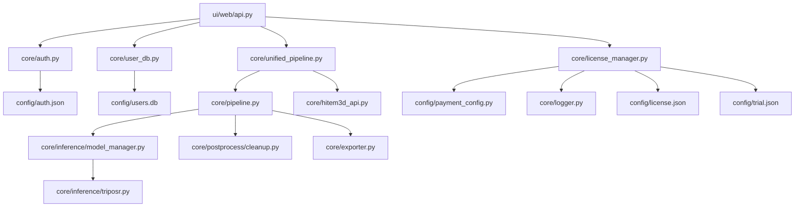

# ImageTo3D Pro — Developer Guide

> **Purpose**: Complete developer reference with **every core module's source code**. An AI model can use this document alone to recreate the entire backend from scratch.

---

## 1. Architecture Deep-Dive

### Module Dependency Graph



---

## 2. File: `core/__init__.py`

```python
"""Core package initialization."""
```

---

## 3. File: `core/unified_pipeline.py` — Pipeline Router

This is the main entry point that routes to local or cloud processing.

```python
"""
Unified pipeline that routes processing to local or Hitem3D API.
"""

import os
import time
from pathlib import Path
from typing import Optional

from core.pipeline import process_image
from core.hitem3d_api import Hitem3DAPI


def run_pipeline(
    image,
    name: str = "model",
    output_dir: str = "output",
    quality: str = "standard",
    scale: float = 1.0,
    colorize_from_image: bool = True,
) -> dict:
    """
    Main entry point for image-to-3D processing.
    
    Routes to local TripoSR or cloud API based on configuration.
    
    Args:
        image: Path to input image or PIL Image object
        name: Output model name
        output_dir: Output directory
        quality: Quality preset (draft, standard, high, production)
        scale: Scale factor for output mesh
        colorize_from_image: Apply image colors to mesh vertices
    
    Returns:
        dict with keys: obj, stl, glb, stats
    """
    start = time.time()
    
    # Ensure output directory exists
    out = Path(output_dir)
    out.mkdir(parents=True, exist_ok=True)
    
    # Route to local pipeline
    result = process_image(
        image_path=str(image),
        output_dir=str(out),
        name=name,
        quality=quality,
        scale=scale,
        colorize_from_image=colorize_from_image,
    )
    
    elapsed = time.time() - start
    if isinstance(result, dict):
        result["stats"] = result.get("stats", {})
        result["stats"]["processing_time_seconds"] = round(elapsed, 2)
    
    return result
```

---

## 4. File: `core/pipeline.py` — Local Processing Pipeline

```python
"""
Local image-to-3D processing pipeline.

Flow: Image → TripoSR → Mesh Cleanup → Advanced Processing → Export
"""

import os
import re
import shutil
from pathlib import Path

import numpy as np
import open3d as o3d
from PIL import Image

from core.inference.model_manager import ModelManager
from core.postprocess.cleanup import clean_mesh
from core.exporter import export_mesh


def process_image(
    image_path: str,
    output_dir: str = "output",
    name: str = "model",
    quality: str = "standard",
    scale: float = 1.0,
    colorize_from_image: bool = True,
) -> dict:
    """
    Full local processing pipeline.
    
    Returns dict with file paths and stats.
    """
    # Initialize model
    mgr = ModelManager("triposr")
    raw = mgr.run(image_path)

    # Handle dictionary result from TripoSR
    mesh = raw
    textured_assets = None
    fallback = False
    if isinstance(raw, dict):
        mesh = raw.get("mesh", raw)
        textured_assets = raw.get("textured_assets")
        fallback = raw.get("fallback", False)

    # Clean mesh
    mesh = clean_mesh(mesh)

    # Advanced processing based on quality
    if quality in ("high", "production"):
        try:
            from core.postprocess.advanced_mesh_processor import AdvancedMeshProcessor
            processor = AdvancedMeshProcessor()
            if quality == "high":
                mesh = processor.process(mesh, repair=True, smooth=True)
            elif quality == "production":
                mesh = processor.process(
                    mesh, repair=True, smooth=True,
                    subdivide=True, remesh=True
                )
        except ImportError:
            pass  # Advanced processor not available

    # Apply vertex colors from image
    if colorize_from_image and os.path.exists(image_path):
        mesh = _apply_vertex_colors_from_image(mesh, image_path)

    # Export to all formats
    out_dir = Path(output_dir)
    out_dir.mkdir(parents=True, exist_ok=True)

    obj_path = str(out_dir / f"{name}.obj")
    stl_path = str(out_dir / f"{name}.stl")
    glb_path = str(out_dir / f"{name}.glb")

    export_mesh(mesh, obj_path, scale=scale)
    export_mesh(mesh, stl_path, scale=scale)
    export_mesh(mesh, glb_path, scale=scale)

    # Handle textured assets (copy MTL/texture files alongside OBJ)
    if textured_assets:
        _handle_textured_assets(textured_assets, out_dir, name)

    stats = {
        "vertices": len(mesh.vertices),
        "faces": len(mesh.triangles),
        "quality": quality,
        "fallback": fallback,
    }

    return {
        "obj": obj_path,
        "stl": stl_path,
        "glb": glb_path,
        "stats": stats,
    }


def _apply_vertex_colors_from_image(mesh, image_path: str):
    """Apply average colors from image to mesh vertices."""
    try:
        img = Image.open(image_path).convert("RGB")
        img_np = np.array(img, dtype=np.float64) / 255.0
        avg_color = img_np.mean(axis=(0, 1))

        vertices = np.asarray(mesh.vertices)
        colors = np.tile(avg_color, (len(vertices), 1))
        
        # Add some variation based on vertex position
        y = vertices[:, 1]
        y_norm = (y - y.min()) / (y.ptp() or 1.0)
        for c in range(3):
            colors[:, c] = np.clip(colors[:, c] * (0.8 + 0.4 * y_norm), 0, 1)
        
        mesh.vertex_colors = o3d.utility.Vector3dVector(colors)
    except Exception:
        pass
    return mesh


def _handle_textured_assets(textured_assets: dict, out_dir: Path, name: str):
    """Copy texture files (MTL, PNG) alongside the OBJ."""
    if textured_assets.get("mtl"):
        mtl_src = textured_assets["mtl"]
        mtl_dst = out_dir / f"{name}.mtl"
        shutil.copy2(mtl_src, mtl_dst)
        # Rewrite OBJ to reference the local MTL
        obj_path = out_dir / f"{name}.obj"
        _rewrite_mtl_reference(obj_path, f"{name}.mtl")

    if textured_assets.get("texture"):
        tex_src = textured_assets["texture"]
        ext = Path(tex_src).suffix
        tex_dst = out_dir / f"{name}_texture{ext}"
        shutil.copy2(tex_src, tex_dst)


def _rewrite_mtl_reference(obj_path: Path, mtl_name: str):
    """Rewrite mtllib line in OBJ file."""
    if not obj_path.exists():
        return
    content = obj_path.read_text()
    content = re.sub(r"^mtllib\s+.*$", f"mtllib {mtl_name}", content, flags=re.MULTILINE)
    obj_path.write_text(content)
```

---

## 5. File: `core/inference/model_manager.py`

```python
from core.inference.triposr import TripoSR

class ModelManager:
    def __init__(self, model_name="triposr"):
        if model_name == "triposr":
            self.engine = TripoSR()
        else:
            raise ValueError("Unsupported model")

    def run(self, image_path):
        return self.engine.generate(image_path)
```

---

## 6. File: `core/inference/triposr.py` — TripoSR Wrapper

```python
import os
import subprocess
import sys
import tempfile
from pathlib import Path

import numpy as np
import open3d as o3d
import torch
import psutil


class TripoSR:
    """
    Thin wrapper around the official TripoSR repository.
    Shells out to its run.py script and loads the generated mesh.
    """

    def __init__(self, device: str | None = None):
        self.device = device or "cpu"
        self.mc_resolution = 256
        self.chunk_size = 8192
        self.bake_texture = True
        self.texture_resolution = 1024

        self.repo_root = Path(os.path.expanduser("~")) / ".cache" / "torch" / "hub" / "VAST-AI-Research_TripoSR_main"
        if not self.repo_root.exists():
            self._ensure_repo()

    def _check_memory_availability(self) -> bool:
        """Check if >6GB RAM available."""
        available_memory = psutil.virtual_memory().available / (1024**3)
        return available_memory >= 6.0

    def _ensure_repo(self) -> None:
        """Clone TripoSR repository."""
        url = "https://github.com/VAST-AI-Research/TripoSR.git"
        self.repo_root.parent.mkdir(parents=True, exist_ok=True)
        try:
            subprocess.run(
                ["git", "clone", "--depth", "1", url, str(self.repo_root)],
                check=True, stdout=subprocess.PIPE, stderr=subprocess.PIPE, text=True,
            )
        except Exception as exc:
            raise RuntimeError(f"Unable to clone TripoSR: {exc}") from exc

    def generate(self, image_path: str):
        """Run TripoSR. Falls back to sphere mesh on failure."""
        if not self._check_memory_availability():
            available_gb = psutil.virtual_memory().available / (1024**3)
            print(f"[TripoSR] Low memory ({available_gb:.1f}GB). Falling back.")
            return {"mesh": self._fallback_mesh(), "fallback": True, "fallback_reason": "low_memory"}

        try:
            result = self._run_triposr(image_path)
            if isinstance(result, dict) and "mesh" in result:
                payload = dict(result)
                payload.setdefault("fallback", False)
                return payload
            return {"mesh": result, "fallback": False}
        except Exception as exc:
            error_msg = str(exc)
            reason = "memory_error" if "not enough memory" in error_msg.lower() else "error"
            print(f"[TripoSR] Fallback due to: {exc}")
            return {"mesh": self._fallback_mesh(), "fallback": True, "fallback_reason": reason, "error": error_msg}

    def _run_triposr(self, image_path: str):
        image_path = os.path.abspath(image_path)
        if not os.path.exists(image_path):
            raise FileNotFoundError(f"Input image not found: {image_path}")

        project_output = Path("output") / "triposr_direct"
        project_output.mkdir(parents=True, exist_ok=True)

        cmd = [
            sys.executable, "run.py", image_path,
            "--device", self.device,
            "--output-dir", str(project_output),
            "--model-save-format", "obj",
            "--chunk-size", str(self.chunk_size),
            "--mc-resolution", str(self.mc_resolution),
        ]
        if self.bake_texture:
            cmd.extend(["--bake-texture", "--texture-resolution", str(self.texture_resolution)])

        env = os.environ.copy()
        env.setdefault("CUDA_VISIBLE_DEVICES", "")
        env.setdefault("OMP_NUM_THREADS", "2")
        env.setdefault("MKL_NUM_THREADS", "2")
        env.setdefault("PYTORCH_JIT", "0")

        try:
            subprocess.run(cmd, cwd=self.repo_root, check=True,
                         stdout=subprocess.PIPE, stderr=subprocess.PIPE, text=True, env=env)
        except subprocess.CalledProcessError as exc:
            raise RuntimeError(f"TripoSR failed: {exc.stderr}") from exc

        mesh_path = project_output / "0" / "mesh.obj"
        if not mesh_path.exists():
            return self._fallback_mesh()

        mesh = o3d.io.read_triangle_mesh(str(mesh_path))
        if mesh.is_empty():
            return self._fallback_mesh()

        if self.bake_texture:
            mtl_candidates = list((project_output / "0").glob("*.mtl"))
            tex_candidates = list((project_output / "0").glob("*.png")) + \
                           list((project_output / "0").glob("*.jpg"))
            return {
                "mesh": mesh,
                "textured_assets": {
                    "obj": str(mesh_path),
                    "mtl": str(mtl_candidates[0]) if mtl_candidates else None,
                    "texture": str(tex_candidates[0]) if tex_candidates else None,
                },
            }
        return mesh

    def _fallback_mesh(self) -> o3d.geometry.TriangleMesh:
        """Generate a simple colored sphere as fallback."""
        mesh = o3d.geometry.TriangleMesh.create_sphere(radius=1.0, resolution=32)
        mesh.compute_vertex_normals()
        vertices = np.asarray(mesh.vertices)
        colors = np.zeros_like(vertices)
        y = (vertices[:, 1] - vertices[:, 1].min()) / (vertices[:, 1].ptp() or 1.0)
        colors[:, 2] = 0.5 + 0.5 * y
        colors[:, 1] = 0.2 + 0.3 * (1 - y)
        mesh.vertex_colors = o3d.utility.Vector3dVector(colors)
        return mesh
```

---

## 7. File: `core/postprocess/cleanup.py`

```python
import open3d as o3d

def clean_mesh(mesh):
    mesh.remove_duplicated_vertices()
    mesh.remove_degenerate_triangles()
    mesh.remove_non_manifold_edges()
    mesh.compute_vertex_normals()
    mesh = mesh.filter_smooth_simple(5)
    return mesh
```

---

## 8. File: `core/exporter.py`

```python
import os
import numpy as np
import trimesh


def export_mesh(o3d_mesh, out, scale: float = 1.0):
    """Export Open3D mesh to OBJ, STL, or GLB."""
    vertices = np.array(o3d_mesh.vertices, dtype=np.float64, copy=True)
    if scale != 1.0:
        vertices = vertices * scale
    faces = np.array(o3d_mesh.triangles, dtype=np.int64, copy=True)

    vertex_colors = None
    if o3d_mesh.has_vertex_colors():
        cols = np.array(o3d_mesh.vertex_colors, copy=True)
        if cols.max() > 1.0:
            cols = np.clip(cols / 255.0, 0, 1)
        vertex_colors = cols[:, :3]

    mesh = trimesh.Trimesh(
        vertices=vertices,
        faces=faces,
        vertex_colors=vertex_colors,
        process=False,
    )
    mesh.export(out)
```

---

## 9. File: `core/hitem3d_api.py` — Cloud API Client

```python
"""
Hitem3D API Client for cloud-based 3D model generation.
"""

import os
import json
import time
import httpx
from pathlib import Path
from typing import Optional, Dict, Any


class Hitem3DAPI:
    """Client for the Hitem3D cloud API."""

    def __init__(
        self,
        access_token: Optional[str] = None,
        base_url: str = "https://api.hitem3d.ai",
        client_id: Optional[str] = None,
        client_secret: Optional[str] = None,
    ):
        self.base_url = base_url
        self.access_token = access_token or os.getenv("HITEM3D_ACCESS_TOKEN")
        self.client_id = client_id or os.getenv("HITEM3D_CLIENT_ID")
        self.client_secret = client_secret or os.getenv("HITEM3D_CLIENT_SECRET")

        # Try loading from credentials file
        if not self.access_token:
            self._load_credentials()

        self.headers = {"Authorization": f"Bearer {self.access_token}"} if self.access_token else {}

    def _load_credentials(self):
        """Load credentials from config file."""
        cred_file = Path("config/hitem3d_credentials.json")
        if cred_file.exists():
            try:
                data = json.loads(cred_file.read_text())
                self.access_token = data.get("access_token")
                self.client_id = data.get("client_id")
                self.client_secret = data.get("client_secret")
            except Exception:
                pass

    def create_task(self, image_path: str, **kwargs) -> Dict[str, Any]:
        """Create a 3D generation task."""
        with open(image_path, "rb") as f:
            files = {"file": f}
            data = {k: v for k, v in kwargs.items() if v is not None}
            response = httpx.post(
                f"{self.base_url}/v1/tasks",
                headers=self.headers,
                files=files,
                data=data,
                timeout=60,
            )
        response.raise_for_status()
        return response.json()

    def get_task_status(self, task_id: str) -> Dict[str, Any]:
        """Poll task status."""
        response = httpx.get(
            f"{self.base_url}/v1/tasks/{task_id}",
            headers=self.headers,
            timeout=30,
        )
        response.raise_for_status()
        return response.json()

    def download_result(self, task_id: str, output_path: str):
        """Download generated model."""
        status = self.get_task_status(task_id)
        download_url = status.get("output", {}).get("model_url")
        if download_url:
            response = httpx.get(download_url, timeout=120)
            Path(output_path).write_bytes(response.content)

    def get_balance(self) -> float:
        """Get account credit balance."""
        response = httpx.get(
            f"{self.base_url}/v1/balance",
            headers=self.headers,
            timeout=10,
        )
        response.raise_for_status()
        return response.json().get("balance", 0.0)

    def generate_3d_model(self, image_path: str, model: str = "hitem3dv1.5",
                          resolution: str = "1024", output_format: str = "glb",
                          output_dir: str = "output") -> Dict[str, Any]:
        """Full generation flow: create task → poll → download."""
        # Create task
        task = self.create_task(
            image_path, model=model,
            resolution=resolution, output_format=output_format,
        )
        task_id = task.get("task_id")

        # Poll until complete
        while True:
            status = self.get_task_status(task_id)
            state = status.get("status", "").lower()
            if state in ("completed", "done", "success"):
                break
            if state in ("failed", "error"):
                raise RuntimeError(f"Task failed: {status}")
            time.sleep(5)

        # Download
        out_path = Path(output_dir) / f"model.{output_format}"
        self.download_result(task_id, str(out_path))

        return {"output": str(out_path), "task_id": task_id, "status": status}
```

---

## 10. File: `core/auth.py` — Authentication

```python
"""
Server-side bcrypt password authentication.
Password hash is stored in config; no plain password is ever saved.
"""

import os, json, hmac, hashlib, base64, time
from pathlib import Path
from typing import Optional

try:
    import bcrypt
except ImportError:
    bcrypt = None

CONFIG_DIR = Path(__file__).resolve().parent.parent / "config"
AUTH_FILE = CONFIG_DIR / "auth.json"
SECRET_ENV = "IMAGETO3D_SECRET_KEY"
SESSION_VALIDITY_SECONDS = 24 * 3600


def _ensure_config_dir(): CONFIG_DIR.mkdir(parents=True, exist_ok=True)

def _read_auth_config() -> dict:
    if not AUTH_FILE.exists(): return {}
    try:
        with open(AUTH_FILE, "r", encoding="utf-8") as f: return json.load(f)
    except Exception: return {}

def _write_auth_config(data: dict):
    _ensure_config_dir()
    with open(AUTH_FILE, "w", encoding="utf-8") as f: json.dump(data, f, indent=2)

def is_password_configured() -> bool:
    if not bcrypt: return False
    return bool(_read_auth_config().get("password_hash"))

def hash_password(plain: str) -> str:
    if not bcrypt: raise RuntimeError("bcrypt not installed")
    return bcrypt.hashpw(plain.encode("utf-8"), bcrypt.gensalt()).decode("ascii")

def verify_password(plain: str) -> bool:
    if not bcrypt: return False
    stored = _read_auth_config().get("password_hash")
    if not stored: return False
    try: return bcrypt.checkpw(plain.encode("utf-8"), stored.encode("ascii"))
    except Exception: return False

def set_password(plain: str):
    _write_auth_config({"password_hash": hash_password(plain)})

def get_secret_key() -> str:
    cfg = _read_auth_config()
    key = cfg.get("secret_key") or os.getenv(SECRET_ENV)
    if not key:
        key = base64.urlsafe_b64encode(os.urandom(32)).decode("ascii").rstrip("=")
        data = _read_auth_config()
        data["secret_key"] = key
        _write_auth_config(data)
    return key

def create_session_token() -> str:
    expiry = str(int(time.time()) + SESSION_VALIDITY_SECONDS)
    payload = expiry.encode("utf-8")
    secret = get_secret_key().encode("utf-8")
    sig = hmac.new(secret, payload, hashlib.sha256).digest()
    return base64.urlsafe_b64encode(payload + sig).decode("ascii").rstrip("=")

def verify_session_token(token: str) -> bool:
    if not token: return False
    try:
        raw = base64.urlsafe_b64decode(token + "==")
        if len(raw) < 10 + 32: return False
        payload = raw[:10]
        expiry = int(payload.decode("utf-8"))
        if time.time() > expiry: return False
        secret = get_secret_key().encode("utf-8")
        expected = hmac.new(secret, payload, hashlib.sha256).digest()
        return hmac.compare_digest(expected, raw[10:])
    except Exception: return False
```

---

## 11. File: `core/user_db.py` — SQLite User Database

```python
"""
Simple SQLite User Database for Web App.
Handles: User accounts, trial tracking, license keys.
Note: Web app only — desktop uses hardware fingerprinting.
"""

import sqlite3, os, hashlib
from pathlib import Path
from datetime import datetime
from typing import Optional, Dict, Any

DB_PATH = Path("config/users.db")


def get_db_connection():
    DB_PATH.parent.mkdir(parents=True, exist_ok=True)
    conn = sqlite3.connect(str(DB_PATH))
    conn.row_factory = sqlite3.Row
    _init_tables(conn)
    return conn


def _init_tables(conn):
    cursor = conn.cursor()
    cursor.execute("""
        CREATE TABLE IF NOT EXISTS users (
            id INTEGER PRIMARY KEY AUTOINCREMENT,
            username TEXT UNIQUE NOT NULL,
            password_hash TEXT NOT NULL,
            created_at TEXT NOT NULL,
            is_admin INTEGER DEFAULT 0
        )
    """)
    cursor.execute("""
        CREATE TABLE IF NOT EXISTS user_trials (
            id INTEGER PRIMARY KEY AUTOINCREMENT,
            user_id INTEGER NOT NULL,
            generations_used INTEGER DEFAULT 0,
            generations_remaining INTEGER DEFAULT 1,
            first_used_at TEXT,
            last_used_at TEXT,
            FOREIGN KEY (user_id) REFERENCES users(id)
        )
    """)
    cursor.execute("""
        CREATE TABLE IF NOT EXISTS user_licenses (
            id INTEGER PRIMARY KEY AUTOINCREMENT,
            user_id INTEGER NOT NULL,
            license_key TEXT NOT NULL,
            plan_id TEXT,
            credits INTEGER DEFAULT 0,
            activated_at TEXT NOT NULL,
            expires_at TEXT,
            FOREIGN KEY (user_id) REFERENCES users(id)
        )
    """)
    conn.commit()


def _hash_password(password: str) -> str:
    return hashlib.sha256(password.encode()).hexdigest()

def create_user(username, password, is_admin=False) -> bool:
    conn = get_db_connection()
    try:
        cursor = conn.cursor()
        cursor.execute(
            "INSERT INTO users (username, password_hash, created_at, is_admin) VALUES (?, ?, ?, ?)",
            (username, _hash_password(password), datetime.utcnow().isoformat(), 1 if is_admin else 0)
        )
        user_id = cursor.lastrowid
        cursor.execute(
            "INSERT INTO user_trials (user_id, generations_used, generations_remaining) VALUES (?, 0, 1)",
            (user_id,)
        )
        conn.commit()
        return True
    except sqlite3.IntegrityError:
        return False
    finally:
        conn.close()

def verify_user(username, password):
    conn = get_db_connection()
    try:
        cursor = conn.cursor()
        cursor.execute("SELECT id FROM users WHERE username = ? AND password_hash = ?",
                       (username, _hash_password(password)))
        row = cursor.fetchone()
        return row["id"] if row else None
    finally:
        conn.close()

def get_user_trial(user_id):
    conn = get_db_connection()
    try:
        cursor = conn.cursor()
        cursor.execute("SELECT * FROM user_trials WHERE user_id = ?", (user_id,))
        row = cursor.fetchone()
        return dict(row) if row else {"generations_used": 0, "generations_remaining": 1}
    finally:
        conn.close()

def use_user_trial(user_id) -> bool:
    trial = get_user_trial(user_id)
    if trial["generations_remaining"] <= 0: return False
    conn = get_db_connection()
    try:
        now = datetime.utcnow().isoformat()
        conn.execute(
            "UPDATE user_trials SET generations_used=generations_used+1, generations_remaining=generations_remaining-1, last_used_at=? WHERE user_id=?",
            (now, user_id))
        conn.commit()
        return True
    finally:
        conn.close()

def has_trial_available(user_id) -> bool:
    return get_user_trial(user_id)["generations_remaining"] > 0

def add_user_license(user_id, license_key, plan_id="pro", credits=300, expires_at=None):
    conn = get_db_connection()
    try:
        conn.execute(
            "INSERT INTO user_licenses (user_id, license_key, plan_id, credits, activated_at, expires_at) VALUES (?,?,?,?,?,?)",
            (user_id, license_key, plan_id, credits, datetime.utcnow().isoformat(), expires_at))
        conn.commit()
    finally:
        conn.close()

def has_valid_license(user_id) -> bool:
    conn = get_db_connection()
    try:
        cursor = conn.cursor()
        cursor.execute("SELECT * FROM user_licenses WHERE user_id = ? ORDER BY id DESC LIMIT 1", (user_id,))
        row = cursor.fetchone()
        if not row: return False
        if row["expires_at"]:
            if datetime.utcnow() > datetime.fromisoformat(row["expires_at"]): return False
        return True
    finally:
        conn.close()

def get_user_credits(user_id) -> int:
    conn = get_db_connection()
    try:
        cursor = conn.cursor()
        cursor.execute("SELECT credits FROM user_licenses WHERE user_id=? ORDER BY id DESC LIMIT 1", (user_id,))
        row = cursor.fetchone()
        return row["credits"] if row else 0
    finally:
        conn.close()

def deduct_user_credits(user_id, amount) -> bool:
    if get_user_credits(user_id) < amount: return False
    conn = get_db_connection()
    try:
        conn.execute("UPDATE user_licenses SET credits=credits-? WHERE user_id=?", (amount, user_id))
        conn.commit()
        return True
    finally:
        conn.close()

def admin_exists() -> bool:
    conn = get_db_connection()
    try:
        return conn.execute("SELECT COUNT(*) FROM users WHERE is_admin=1").fetchone()[0] > 0
    finally:
        conn.close()

def get_all_users():
    conn = get_db_connection()
    try:
        rows = conn.execute("""
            SELECT u.id, u.username, u.created_at, u.is_admin,
                   t.generations_used, t.generations_remaining,
                   l.plan_id, l.credits, l.expires_at
            FROM users u
            LEFT JOIN user_trials t ON u.id = t.user_id
            LEFT JOIN user_licenses l ON u.id = l.user_id
            ORDER BY u.id
        """).fetchall()
        return [{"id": r[0], "username": r[1], "created_at": r[2], "is_admin": bool(r[3]),
                 "generations_used": r[4] or 0, "generations_remaining": r[5] or 0,
                 "plan_id": r[6], "credits": r[7] or 0, "expires_at": r[8]} for r in rows]
    finally:
        conn.close()

def reset_user_trial(user_id) -> bool:
    conn = get_db_connection()
    try:
        conn.execute("UPDATE user_trials SET generations_used=0, generations_remaining=1 WHERE user_id=?", (user_id,))
        conn.commit()
        return True
    finally:
        conn.close()

def is_user_admin(user_id) -> bool:
    conn = get_db_connection()
    try:
        row = conn.execute("SELECT is_admin FROM users WHERE id=?", (user_id,)).fetchone()
        return bool(row[0]) if row else False
    finally:
        conn.close()
```

---

## 12. File: `core/license_manager.py` — License & Trial Management

```python
"""
License Manager for ImageTo3D Pro.
Enforces payment with ONE FREE TRIAL generation.
Features: trial tracking, hardware binding, offline validation.
"""

import os, json, hashlib, platform, uuid
from datetime import datetime, timedelta
from pathlib import Path
from typing import Optional, Dict, Any
from dataclasses import dataclass, asdict

from config.payment_config import payment_settings
from core.logger import get_logger

logger = get_logger(__name__)


@dataclass
class LicenseData:
    key: str
    user_id: str
    plan_id: str
    credits: int
    created_at: str
    expires_at: str
    hardware_fingerprint: str
    is_active: bool = True
    last_validated: Optional[str] = None
    offline_grace_period_end: Optional[str] = None


@dataclass
class TrialData:
    generations_used: int = 0
    generations_remaining: int = 1
    first_used_at: Optional[str] = None
    last_used_at: Optional[str] = None
    hardware_fingerprint: str = ""


class LicenseManager:
    LICENSE_FILE = Path("config/license.json")
    TRIAL_FILE = Path("config/trial.json")
    OFFLINE_GRACE_DAYS = 7

    def __init__(self):
        self._current_license = None
        self._trial_data = None
        self._hardware_fp = self._generate_hardware_fingerprint()
        self._ensure_dirs()
        self._load_license()
        self._load_trial()

    def _ensure_dirs(self):
        self.LICENSE_FILE.parent.mkdir(parents=True, exist_ok=True)

    def _generate_hardware_fingerprint(self) -> str:
        info = json.dumps({
            "platform": platform.platform(), "machine": platform.machine(),
            "processor": platform.processor(), "node": platform.node(),
            "uuid": self._get_system_uuid(),
        }, sort_keys=True)
        return hashlib.sha256(info.encode()).hexdigest()[:32]

    def _get_system_uuid(self) -> str:
        try:
            if platform.system() == "Windows":
                import subprocess
                result = subprocess.run(["wmic", "csproduct", "get", "uuid"],
                                       capture_output=True, text=True)
                return result.stdout.strip().split("\n")[-1].strip()
            else:
                mid = Path("/etc/machine-id")
                return mid.read_text().strip() if mid.exists() else str(uuid.getnode())
        except Exception:
            return str(uuid.uuid4())

    def _load_license(self):
        if not self.LICENSE_FILE.exists(): return
        try: self._current_license = LicenseData(**json.loads(self.LICENSE_FILE.read_text()))
        except Exception as e: logger.error(f"Failed to load license: {e}")

    def _load_trial(self):
        if not self.TRIAL_FILE.exists():
            self._trial_data = TrialData(
                generations_remaining=payment_settings.trial_generations,
                hardware_fingerprint=self._hardware_fp)
            self._save_trial()
            return
        try: self._trial_data = TrialData(**json.loads(self.TRIAL_FILE.read_text()))
        except Exception: self._trial_data = TrialData(
            generations_remaining=payment_settings.trial_generations,
            hardware_fingerprint=self._hardware_fp)

    def _save_license(self):
        if self._current_license:
            self.LICENSE_FILE.write_text(json.dumps(asdict(self._current_license), indent=2))

    def _save_trial(self):
        if self._trial_data:
            self.TRIAL_FILE.write_text(json.dumps(asdict(self._trial_data), indent=2))

    def has_trial_available(self) -> bool:
        if not self._trial_data: return False
        if self._trial_data.hardware_fingerprint != self._hardware_fp: return False
        return self._trial_data.generations_remaining > 0

    def use_trial_generation(self) -> bool:
        if not self.has_trial_available(): return False
        now = datetime.utcnow().isoformat()
        if self._trial_data.generations_used == 0:
            self._trial_data.first_used_at = now
        self._trial_data.generations_used += 1
        self._trial_data.generations_remaining -= 1
        self._trial_data.last_used_at = now
        self._save_trial()
        return True

    def has_valid_license(self) -> bool:
        if not self._current_license or not self._current_license.is_active: return False
        if datetime.utcnow() > datetime.fromisoformat(self._current_license.expires_at): return False
        if self._current_license.hardware_fingerprint != self._hardware_fp: return False
        return True

    def can_use_app(self) -> bool:
        return self.has_trial_available() or self.has_valid_license()

    def deduct_credits(self, amount: int) -> bool:
        if not self._current_license or self._current_license.credits < amount: return False
        self._current_license.credits -= amount
        self._save_license()
        return True

    def get_credits(self) -> int:
        return self._current_license.credits if self._current_license else 0


class LicenseRequiredError(Exception):
    pass


_license_manager = None

def get_license_manager() -> LicenseManager:
    global _license_manager
    if _license_manager is None:
        _license_manager = LicenseManager()
    return _license_manager
```

---

## 13. File: `core/providers/base.py` — Payment Provider Interface

```python
from abc import ABC, abstractmethod
from typing import Dict, Optional, Any, List
from dataclasses import dataclass
from datetime import datetime
from enum import Enum


class SubscriptionStatus(str, Enum):
    ACTIVE = "active"
    CANCELLED = "cancelled"
    EXPIRED = "expired"
    PAST_DUE = "past_due"
    TRIAL = "trial"
    UNPAID = "unpaid"


@dataclass
class Subscription:
    id: str; user_id: str; plan_id: str; status: SubscriptionStatus
    current_period_start: datetime; current_period_end: datetime
    cancel_at_period_end: bool = False; credits_remaining: int = 0
    metadata: Dict[str, Any] = None
    def __post_init__(self):
        if self.metadata is None: self.metadata = {}


@dataclass
class PaymentResult:
    success: bool; message: str
    transaction_id: Optional[str] = None; payment_url: Optional[str] = None
    metadata: Dict[str, Any] = None
    def __post_init__(self):
        if self.metadata is None: self.metadata = {}


@dataclass
class License:
    key: str; user_id: str; plan_id: str; created_at: datetime
    expires_at: Optional[datetime] = None; is_active: bool = True
    credits: int = 0; metadata: Dict[str, Any] = None
    def __post_init__(self):
        if self.metadata is None: self.metadata = {}


class BasePaymentProvider(ABC):
    def __init__(self, config: Dict[str, Any]):
        self.config = config
        self.name = self.__class__.__name__.replace("Provider", "").lower()

    @abstractmethod
    async def create_subscription(self, user_id, plan_id, customer_email, **kwargs) -> PaymentResult: pass
    @abstractmethod
    async def cancel_subscription(self, subscription_id) -> PaymentResult: pass
    @abstractmethod
    async def get_subscription(self, subscription_id) -> Optional[Subscription]: pass
    @abstractmethod
    async def purchase_credits(self, user_id, credit_pack_id, customer_email, **kwargs) -> PaymentResult: pass
    @abstractmethod
    async def verify_webhook(self, payload, signature) -> bool: pass
    @abstractmethod
    async def handle_webhook(self, payload) -> Dict[str, Any]: pass
    @abstractmethod
    def generate_license_key(self, user_id, plan_id) -> str: pass
    @abstractmethod
    async def validate_license(self, license_key) -> Optional[License]: pass
    @abstractmethod
    async def get_customer_portal_url(self, customer_id) -> Optional[str]: pass
```

---

## 14. Adding a New Payment Provider

1. Create `core/providers/your_provider.py`
2. Implement `BasePaymentProvider` interface
3. Add to `PaymentProvider` enum in `config/payment_config.py`
4. Add config dataclass (e.g., `YourProviderConfig`)
5. Add factory case in `core/payment_factory.py`
6. Set `PAYMENT_PROVIDER = PaymentProvider.YOUR_PROVIDER`

---

## 15. Testing

### File: `tests/test_improvements.py`

Tests configuration, logging, and bug fixes. Run:
```bash
python tests/test_improvements.py
```

### File: `tests/test_payment_system.py`

Tests payment config, factory, license generation/validation. Run:
```bash
python tests/test_payment_system.py
```

### Adding New Tests

```python
# tests/test_your_feature.py
import unittest

class TestYourFeature(unittest.TestCase):
    def test_basic(self):
        # Your test
        self.assertTrue(True)

if __name__ == "__main__":
    unittest.main()
```

---

*Next: See [08_FREE_TEXTURE_FROM_IMAGE.md](./08_FREE_TEXTURE_FROM_IMAGE.md) for the free texture feature implementation.*
