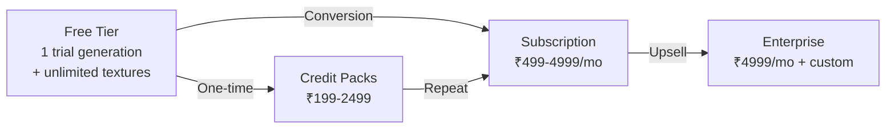
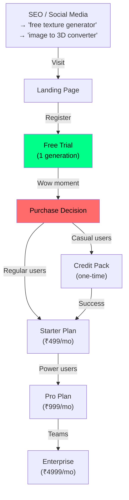

# ImageTo3D Pro — Monetization Strategy

> **Purpose**: Complete monetization playbook — pricing, conversion funnel, payment setup, marketing, and growth levers. Everything needed to turn ImageTo3D Pro into a revenue-generating product.

---

## 1. Revenue Model Overview



### Revenue Streams

| Stream | Description | Expected Revenue |
|--------|-------------|-----------------|
| **Subscriptions** | Monthly plans (Starter/Pro/Enterprise) | Primary |
| **Credit Packs** | One-time purchases for pay-as-you-go | Secondary |
| **Enterprise** | Custom plans, volume licensing | Growth |
| **API Access** | Developer API keys (Pro+ plans) | Emerging |

---

## 2. Pricing Strategy

### 2.1 Subscription Plans

| Plan | Monthly (INR) | Monthly (USD) | Credits | Target Audience |
|------|:------------:|:------------:|:-------:|:----------------|
| **Free Trial** | ₹0 | $0 | 1 generation | Everyone |
| **Starter** | ₹499 | $5.99 | 100 | Hobbyists, students |
| **Pro** | ₹999 | $11.99 | 300 | Freelancers, professionals |
| **Enterprise** | ₹4999 | $59.99 | 2000 | Studios, businesses |

### 2.2 Credit Packs

| Pack | Price (INR) | Price (USD) | Credits | Per-Credit Cost |
|------|:-----------:|:-----------:|:-------:|:---------------:|
| Small | ₹199 | $2.39 | 100 | ₹1.99 |
| Medium | ₹799 | $9.59 | 500 | ₹1.60 |
| Large | ₹2499 | $29.99 | 2000 | ₹1.25 |

### 2.3 Credit Costs Per Operation

| Operation | Credits | Why |
|-----------|:-------:|-----|
| Local processing | 1 | Runs on user's CPU |
| Hitem3D API (512px) | 15 | Cloud GPU |
| Hitem3D API (1024px) | 20 | Cloud GPU, higher res |
| Hitem3D API (1536px) | 50 | Cloud GPU, premium |
| Hitem3D API (1536pro) | 70 | Cloud GPU, highest quality |
| Texture generation | **0** | Free marketing tool |

---

## 3. Conversion Funnel



### Key Conversion Points

1. **Free Texture** → Registration (capture email)
2. **Registration** → Free trial (1 generation)
3. **Trial success** → "That was amazing! Get more for ₹499" CTA
4. **Starter** → "Unlock multi-angle and API" → Pro upsell
5. **Pro** → "Need more? Custom pricing" → Enterprise

---

## 4. Payment Provider Comparison

| Provider | Fee | Setup Time | Best For | GST/Business Required? |
|----------|:---:|:----------:|:---------|:---------------------:|
| **Gumroad** | 10% | 5 minutes | Quick start, global | No |
| **LemonSqueezy** | 5% | 10 minutes | Digital products | No |
| **Razorpay** | 2% | 1-2 days | India-focused | Yes (GST) |
| **Stripe** | 2.9% | 1-2 days | Global, professional | Yes (business) |
| **PayPal** | 3.5% | 30 minutes | International buyers | No |
| **UPI QR** | 0% | Instant | Manual verification | No |

### Recommended Setup Path

```
Phase 1 (Day 1): Gumroad → instant setup, start selling immediately
Phase 2 (Month 2): Add Razorpay → lower fees for Indian customers
Phase 3 (Month 6): Add Stripe → global professional checkout
```

---

## 5. Gumroad Setup (Recommended First Provider)

### Step 1: Create Gumroad Account

1. Go to [gumroad.com](https://gumroad.com) → Sign up (free)
2. No business registration needed
3. Payments to your bank/PayPal

### Step 2: Create Products

Create 6 products in Gumroad dashboard:

| Product Name | Type | Price (INR) | Recurring |
|-------------|------|:-----------:|:---------:|
| ImageTo3D Starter | Membership | ₹499/mo | Yes |
| ImageTo3D Pro | Membership | ₹999/mo | Yes |
| ImageTo3D Enterprise | Membership | ₹4999/mo | Yes |
| 100 Credits Pack | Product | ₹199 | No |
| 500 Credits Pack | Product | ₹799 | No |
| 2000 Credits Pack | Product | ₹2499 | No |

### Step 3: Get Product IDs

After creating products, copy each product's short URL code (e.g., `abcde`) and update `config/payment_config.py`:

```python
product_ids: Dict[str, str] = field(default_factory=lambda: {
    "starter_monthly": "your_starter_product_code",
    "pro_monthly": "your_pro_product_code",
    "enterprise_monthly": "your_enterprise_product_code",
    "credits_small": "your_100_credits_code",
    "credits_medium": "your_500_credits_code",
    "credits_large": "your_2000_credits_code",
})
```

### Step 4: Set Up Webhook

1. Gumroad → Settings → **Ping** (webhook)
2. URL: `https://your-app.onrender.com/webhook/gumroad`
3. Events: Sale, Refund, Subscription cancelled

### Step 5: Get API Token

1. Gumroad → Settings → **Advanced** → **Application**
2. Create application → Copy **Access Token**
3. Set environment variable: `GUMROAD_ACCESS_TOKEN=your_token`

---

## 6. Marketing Channels

### 6.1 SEO (Free, Long-term)

**Target Keywords**:
- "image to 3D model converter" (high intent)
- "free texture generator" (high volume)
- "convert photo to OBJ file" (medium intent)
- "free normal map generator" (medium volume)
- "AI 3D model generator" (trending)

### 6.2 Social Media (Free)

| Platform | Content Type | Frequency |
|----------|-------------|-----------|
| **Twitter/X** | Before/after (image → 3D model) | 3x/week |
| **Reddit** | r/3Dprinting, r/gamedev, r/blender | 2x/week |
| **YouTube** | Tutorial videos, demos | 1x/month |
| **Product Hunt** | Launch + updates | 1x launch |

### 6.3 Content Marketing

- Blog posts: "How to Convert Photos to 3D Models"
- Video tutorials: "Free 3D Model Generator Tutorial"
- Case studies: "How [Creator] Built 100 3D Assets in a Week"

---

## 7. Metrics to Track

| Metric | Target | Tool |
|--------|--------|------|
| Monthly Signups | 500+ | User DB |
| Free→Paid Conversion | 5-10% | Analytics |
| Monthly Revenue (MRR) | ₹50K+ | Gumroad dashboard |
| Churn Rate | < 5%/month | Payment provider |
| Average Revenue Per User | ₹800+ | Revenue / active users |
| Free Texture Users | 2000+/month | Server logs |
| API Usage | Track by plan | Server logs |

---

## 8. Growth Levers

### Lever 1: Free Texture Generator
- Zero cost to serve → unlimited free users
- SEO magnet → "free texture generator online"
- Conversion path: free textures → free 3D trial → paid plan

### Lever 2: Referral Program
- Give 50 free credits for each referral
- "Share with a friend" button in dashboard
- Track via unique referral URLs

### Lever 3: Education/Student Pricing
- 50% off for students (.edu email)
- Free plan for open-source projects
- Partnerships with 3D modeling courses

### Lever 4: API Marketplace
- Sell API access separately for developers
- Per-request pricing (₹2-10 per generation)
- SDKs for Python, JavaScript, Unity

### Lever 5: Enterprise Sales
- Custom pricing for studios
- Volume discounts (10,000+ credits)
- Dedicated support and SLAs

---

## 9. Revenue Projections

### Conservative Scenario

| Month | Free Users | Paid Users | MRR (INR) |
|:-----:|:----------:|:----------:|:---------:|
| 1 | 100 | 5 | ₹4,000 |
| 3 | 500 | 30 | ₹25,000 |
| 6 | 2,000 | 100 | ₹80,000 |
| 12 | 5,000 | 300 | ₹2,50,000 |

Assumptions: 5% conversion, ₹800 ARPU, 3% monthly churn

---

## 10. Implementation Checklist

### Phase 1: Launch (Week 1)
- [ ] Set up Gumroad products and webhook
- [ ] Deploy to Render with payment integration
- [ ] Enable free texture generator (SEO landing page)
- [ ] Post on Product Hunt, Reddit, Twitter

### Phase 2: Growth (Month 1-3)
- [ ] Add Razorpay for Indian payments (lower fees)
- [ ] Implement referral system
- [ ] Start content marketing (blog, YouTube)
- [ ] A/B test pricing (try $7.99 vs $5.99 for Starter)

### Phase 3: Scale (Month 3-6)
- [ ] Add Stripe for international payments
- [ ] Launch API marketplace
- [ ] Enterprise sales outreach
- [ ] Student/education pricing
- [ ] Consider credit rollover policies

---

*This completes the ImageTo3D Pro documentation suite. All 9 files provide a comprehensive blueprint for building, deploying, and monetizing the application.*
